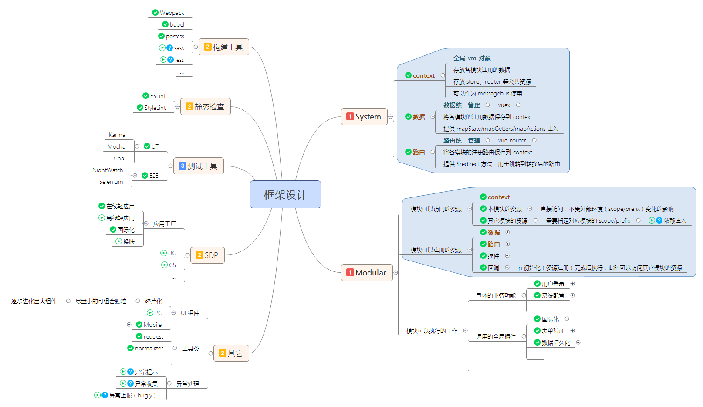

<p align="center">
  <br>
  <sub>基于 Vue 2.x</sub>
</p>
<p align="center">
  <a href="https://travis-ci.org/platojs/plato"></a>
  <a href="https://coveralls.io/github/platojs/plato"></a>
  <a href="https://david-dm.org/platojs/plato"></a>
  <a href="https://david-dm.org/platojs/plato?type=dev"></a>
</p>
<p align="center">
  a Boilerplate for [mobile] SPAs using vue, vuex, vue-router<br>
  Check out <a href="http://platojs.crossjs.com/"><b>文档</b></a>, <a href="http://plato.crossjs.com/#/demo"><b>示例</b></a> and UI <a href="https://github.com/platojs/components"><b>组件</b></a>
</p>
<p align="center">
  
</p>

## 设计原则

[Less is More](https://zh.wikipedia.org/wiki/極簡主義)

[若无必要，勿增实体](https://zh.wikipedia.org/wiki/奥卡姆剃刀)

## 脚手架

**注意：此仓库是实践示例，请不要直接克隆后用于项目开发，应使用如下方式初始化项目**

- [Vue CLI Template](https://github.com/platojs/template)

## 版本锁

**此项目尚处于 Beta 阶段，实际应用时请确保使用 `npm-shrinkwrap.json`**

**`npm run mirror:<sdp|tb|npm>` 可切换依赖项的源（registry）至 SDP、淘宝或 NPM**

## 特性

- [Core](https://github.com/platojs/platojs)
  - [system](https://github.com/platojs/system)
  - [util](https://github.com/platojs/util)
  - [components](https://github.com/platojs/components)
  - [directives](https://github.com/platojs/directives)
  - [plugins](https://github.com/platojs/plugins)
- Vue
  - [Vue](https://github.com/vuejs/vue)
  - [Vue-Router](https://github.com/vuejs/vue-router)
  - [Vuex](https://github.com/vuejs/vuex)
  - [Vuex-Actions](https://github.com/weinot/vuex-actions) (for async actions)
  - [Vuex-LocalStorage](https://github.com/crossjs/vuex-localstorage) (for cache and persistence)
- Build
  - [Webpack](http://webpack.github.io/)
- Linters
  - [ESLint](http://eslint.org/)
  - [stylelint](http://stylelint.io/)
- Tests
  - [Karma](https://karma-runner.github.io/)
  - [Mocha](https://mochajs.org/)
  - [Nightwatch](http://nightwatchjs.org/)
  - [Selenium-Server](https://github.com/eugeneware/selenium-server)
- Transformers
  - [PostCSS](http://postcss.org/) (for css next)
    - [postcss-rtl](https://github.com/vkalinichev/postcss-rtl)
    - [postcss-flexible](https://github.com/crossjs/postcss-flexible) (for [lib.flexible](https://github.com/amfe/lib-flexible))
    - ...
  - [Babel](https://babeljs.io/) (for es6)
- Worth Reading Modules
  - [Logger](src/modules/logger)
  - [Persist](src/modules/persist)
  - [I18n](src/modules/i18n)
  - [Validator](src/modules/validator)
  - [Request](src/modules/request)

## 使用方法

```bash
# 安装依赖项。通过指定镜像提高安装速度
npm run init

# 锁定依赖项版本。使用 npm shrinkwrap
npm run lock

# 启动开发服务。访问地址：localhost:3000
npm run dev

# eslint, stylelint, unit and e2e test
npm test

# test, clean, and compile
npm run build

# serve dist, like production
npm start

# generate demo site and push to gh-pages
npm run demo

# push modifications to github
npm run push
```

## 兼容性

- IE 9+
- Chrome
- Safari
- Firefox
- ...
- Android 4+
- iOS 7+

## 版权

[MIT](http://opensource.org/licenses/MIT)
